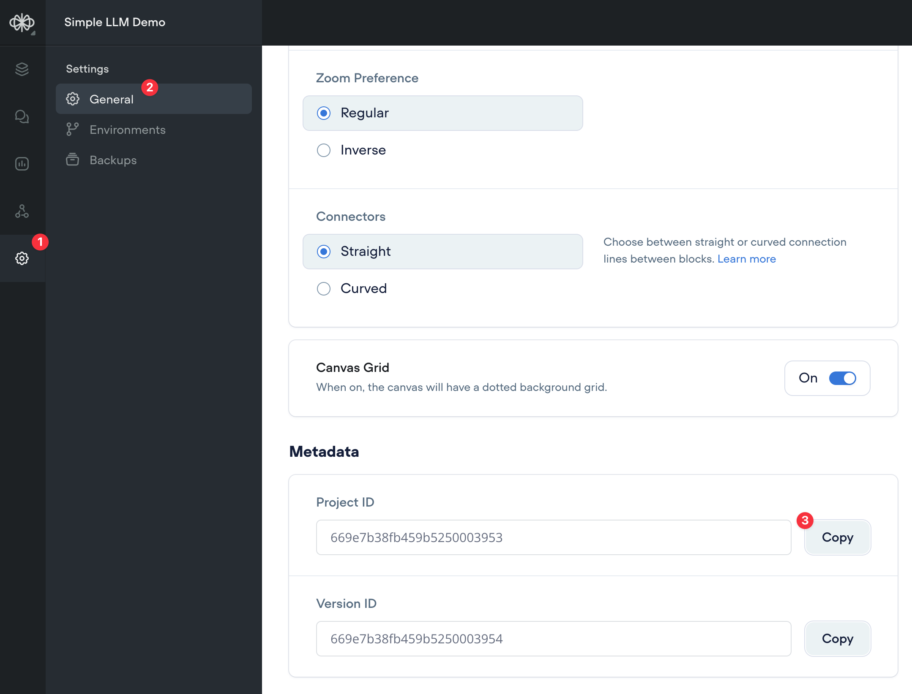
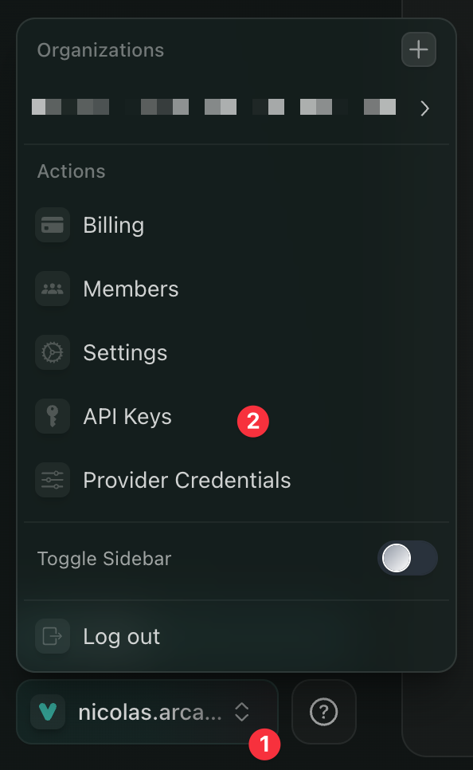
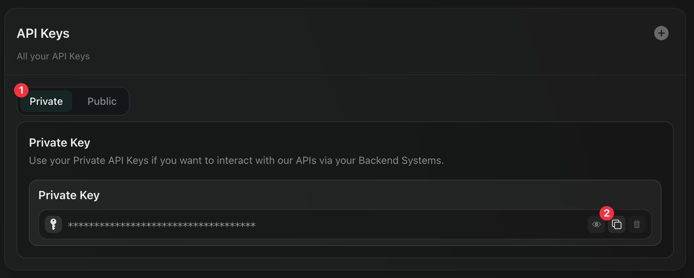

# Voiceflow Vapi Custom LLM integration

## STEP 1: Voiceflow
#### Import the Agent demo file on your Voiceflow workspace.
Import the **vapi_agent.vf** file on your Voiceflow workspace by clicking on the import button.


Open your agent and be sure to test the **Agent** demo at least once to compile the version if your **VOICEFLOW_VERSION_ID** is set to **development**, or to click on the **Publish** button if you've set the **VOICEFLOW_VERSION_ID** to **production**.

Retrieve the **Voiceflow API key** from the Voiceflow integrations view.


Retrieve the Voiceflow **project ID** from the Voiceflow settings view.



## STEP 2: THE INTEGRATION
#### Create the .env file

``` bash
cp .env.template .env
```
Update the .env file with your **Voiceflow API key** and **project ID**.


#### Start the server

``` bash
npm run setup
```

``` bash
npm start
```

#### Start ngrok on your port
``` bash
ngrok HTTP 3101
```

Save the ngrok forwarding url for next step to update the Custom LLM endpoint in the VAPI assistant.


## STEP 3: VAPI
Create a **new blank assistant**


Copy the **assistant ID** and save it for later


Retrieve you **private API key** from the VAPI dashboard




Now, we are going to update the **VAPI assistant** using the VAPI API.

In the following curl command, replace the placeholders with your values.

{VAPI_ASSISTANT_ID} is the ID of the VAPI assistant you've just created.
{VAPI_PRIVATE_API_KEY} is the private API key you retrieved earlier.
{NGROK_URL} is the ngrok url you retrieved earlier.


``` bash
curl --request PATCH \
  --url https://api.vapi.ai/assistant/{VAPI_ASSISTANT_ID} \
  --header 'Authorization: Bearer {VAPI_PRIVATE_API_KEY}' \
  --header 'Content-Type: application/json' \
  --data '{
  "voice": {
		"speed": 0.9,
		"voiceId": "melissa",
		"provider": "playht",
		"fillerInjectionEnabled": false
	},
	"recordingEnabled": false,
	"endCallFunctionEnabled": true,
	"firstMessageMode":"assistant-speaks-first-with-model-generated-message",
	"model": {
		"url": "{NGROK_URL}/api",
		"model": "dmapi",
		"provider": "custom-llm"
	},
	"transcriber": {
		"model": "nova-2",
		"language": "en",
		"provider": "deepgram"
	},
	"silenceTimeoutSeconds": 25,
	"clientMessages": [
		"transcript",
		"hang",
		"function-call",
		"speech-update",
		"metadata",
		"conversation-update"
	],
	"serverMessages": [
		"end-of-call-report",
		"status-update",
		"hang",
		"function-call"
	],
	"backgroundSound": "office"
}'
```

## STEP 4: TESTING
On VAPI, click on the **Talk** button to test your assistant.


